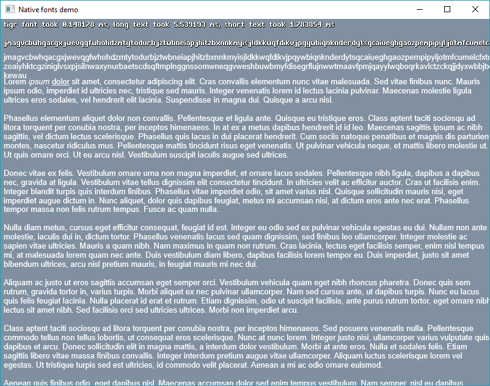
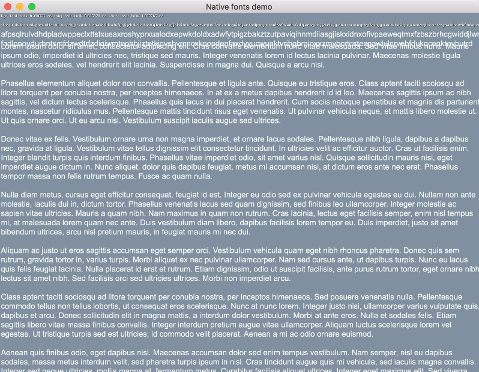

# nativefonts

A simple, MIT licensed, way to use native font rendering.

### Native backends

Currently we support :

- DirectWrite
- Core Text

### API

The API contains only 4 functions : everything you need to do simple text-to-bitmap rendering.

```C
nf_system_info_t nf_system_info();

// returns 0 on error
nf_font_t nf_font(const char * font_name, nf_font_params_t params);

void nf_free(nf_font_t font);

// returns < 0 on error
int nf_print(
	void * bitmap, uint16_t w, uint16_t h,
	nf_font_t font, nf_feature_t * features, size_t features_count,
	nf_aabb_t * result_rect, const char * text, ...);
```

The only available bitmap format so far is B8G8R8A8_UNORM with premultiplied alpha, because it's the only color format we can get from DirectWrite natively.

### Examples

Rendering on Windows 10:


Rendering on OSX retina (screenshot was downscaled to 50%):


### TODO

- One header deployment, aka stb.
- Support font params on Core Text.
- Support font features on Core Text.
- More layout/rich text features.
- Check Core Text implementation on memory leaks.
